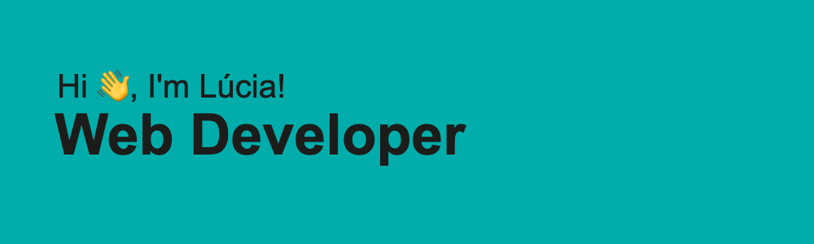

# About Me

🚀 Web Developer exploring the intersection of code and creativity.

Hello! I'm Lúcia Leitão, a dedicated Web Developer currently interested in a professional project experience that progresses my career and also fosters an environment that promotes continuous learning.

What Sets Me Apart:

🎨 Design Fusion: I bring creativity and precision to projects, blending my background in Graphic and Digital Design.
🎓 Continuous Learning: Keeping up with the latest web development methodologies, like Agile, is my thing.

 
 

# Technologies

  
  
  
  
  
  
  
  
  
  
  
  
  
  
  
  
  
  
  
  
  

 
 

#  🔭 I’m currently working on ...

<section>
    

        
 Real Estate | E-commerce app

      <u>Technologies:</u>
      <ul>
        <li>MONGOdb</li>
        <li>ExpressJS</li>
        <li>React</li>
        <li>NextJs</li>
        <li><a href="https://github.com/LuciaLeitao/MERNlucia">See project Here!</a></li>
      </ul>        
    

    

        
kanbanApp

        <u>Technologies:</u>
      <ul>
        <li>HTLM</li>
        <li>CSS</li>
        <li>JS</li>
        <ul>
        <li><a href="https://github.com/LuciaLeitao/MERNlucia">See project Here!</a> </li>
      </ul> 
      </ul>     
    

    

        
Pig Game

        <u>Technologies:</u>
      <ul>
        <li>HTLM</li>
        <li>CSS</li>
        <li>JS</li>
        <li><a href="https://github.com/LuciaLeitao/kabanApp">See project Here!</a> </li>
      </ul>   
    

</section>

  
 
 

#  🌱 I’m currently learning ...

- 

  
  
  
  
  
  
  
  
  
  
  

 
 

#  📫 How to reach me: 

  <a href = "mailto: lucialeitao85@gmail.com" target="_blank">
    
 

###

###

###

###

